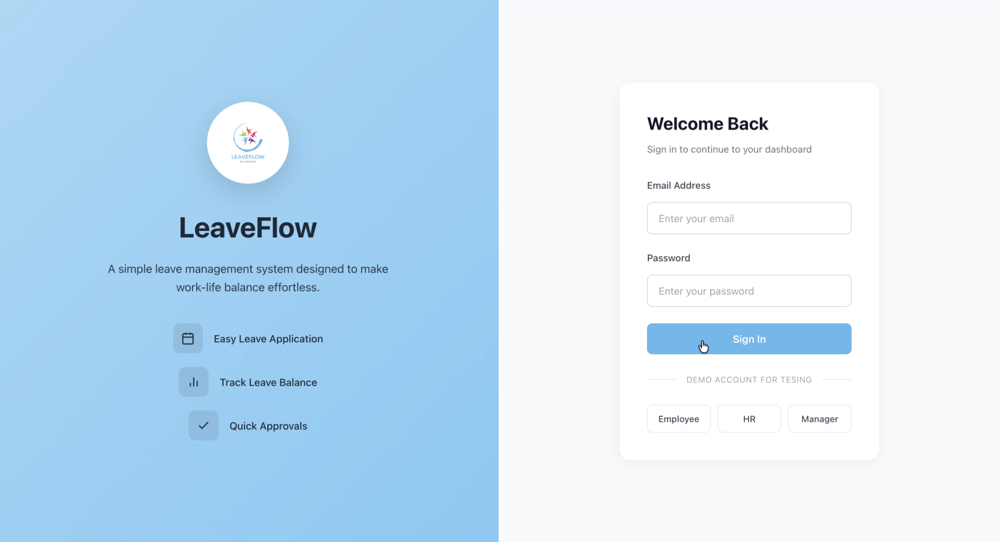
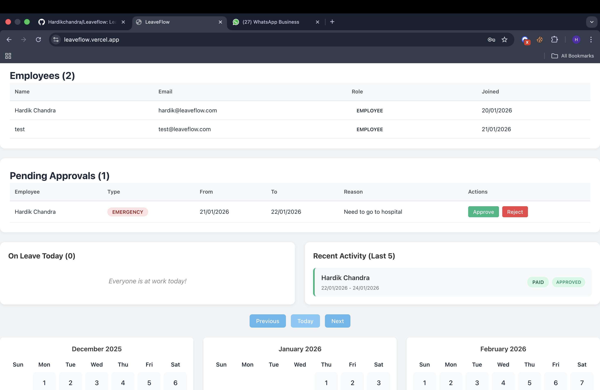
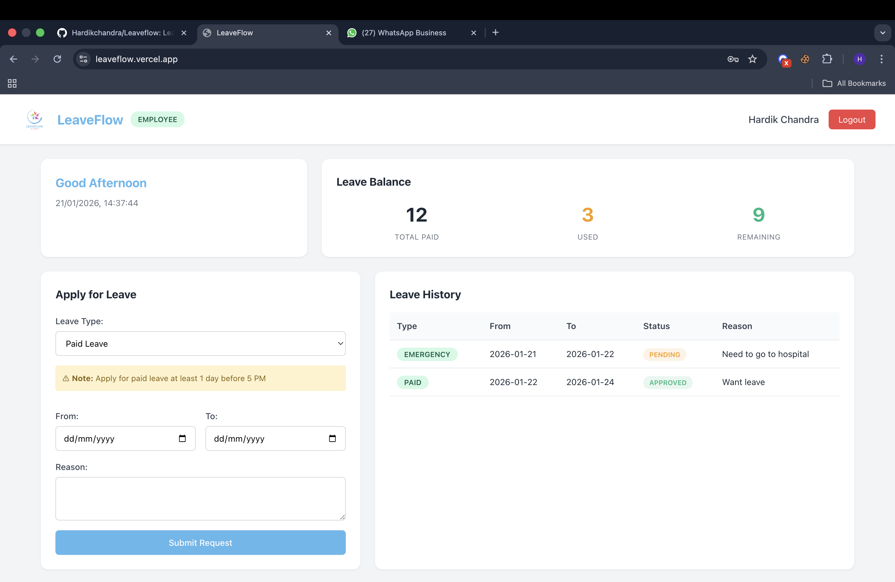
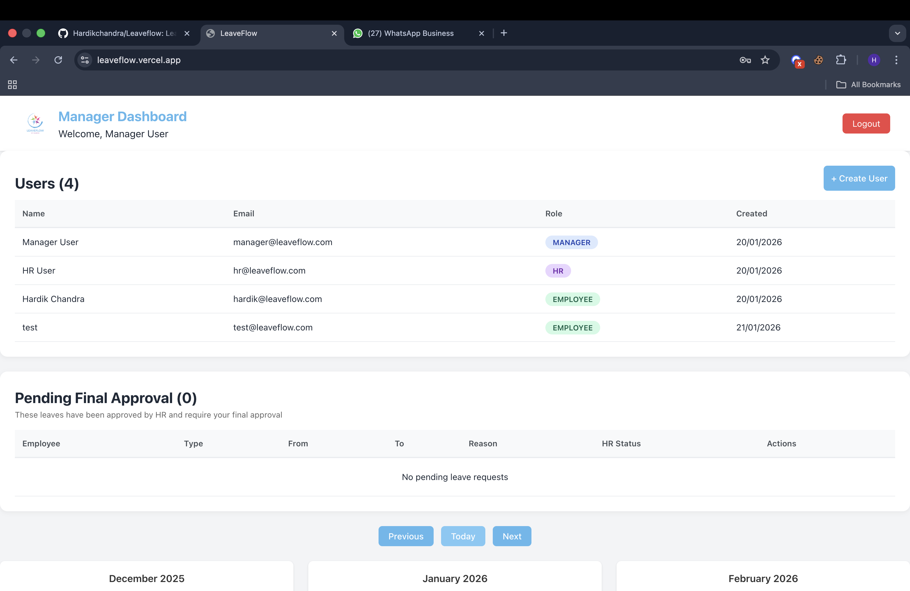

# LeaveFlow — Leave Management System

LeaveFlow is a simple and lightweight leave management system built to make requesting and approving leave easy — without unnecessary complexity.

It’s designed for small to mid-sized teams that want a clean, role-based workflow instead of bulky HR software.

---

## Why LeaveFlow?

Most teams don’t need a complicated HR tool just to manage leave.

### The problem  
Leave requests are often handled over WhatsApp, email, or spreadsheets, which leads to confusion, missed approvals, unclear leave balances, and lack of visibility.

### The solution  
LeaveFlow provides a clear and structured workflow where:

- Employees apply for leave in just a few clicks  
- HR reviews requests when required  
- Managers give final approval  
- Everyone can clearly track leave status and history  

---

## How LeaveFlow Works

1. Employees submit leave requests (Paid, Medical, Emergency, or Unpaid)
2. Leave duration is calculated automatically
3. Valid paid leaves can be auto-approved based on rules
4. Other requests move through HR → Manager approval
5. Leave balances update instantly after approval

---

##  Screenshots

###  Login


### Dashboard


###  Apply Leave


###  Leave History


---

## 🎥 Demo Video

<video width="800" controls>
  <source src="./Demo_leaveflow.mp4" type="video/mp4">
  Your browser does not support the video tag.
</video>

---

## 🚀 Deployment Overview

- **Frontend**: React (Vercel)
- **Backend**: Node.js + Express (PM2)
- **Reverse Proxy**: Nginx (FastPanel)
- **Domain**: `https://hardik.gigawiz.dev`
- **SSL**: Let’s Encrypt (HTTPS enforced)

---

## 🧠 Key Highlights

- Clean role-based access (Employee, HR, Manager)
- Simple UI focused on usability
- Secure API with HTTPS
- Lightweight and easy to extend
- Built with real-world team workflows in mind

---

## 📌 Notes

- Screenshots are stored inside the `screenshots/` folder
- Demo video (`demo.mp4`) is kept in the repository root
- Backend APIs are served securely over HTTPS

## How It Works

- Employees apply for leave by selecting the type (Paid, Medical, Emergency, or Unpaid), dates, and a short reason.
- The system automatically calculates the number of leave days.
- If a Paid Leave is applied at least 1 day before 5 PM, it gets auto-approved and the leave balance is updated instantly.
- All other leave requests are first reviewed by HR.
- Once HR approves, the request goes to the Manager for final approval.
- After approval, leave balances are updated and reflected in the system.
- A calendar and activity logs show who is on leave and the current status of each request.

## Live roles and demo accounts
Use these to explore the app end-to-end:
- Manager: manager@leaveflow.com / 123456
- HR: hr@leaveflow.com / 123456
- Employee: hardik@leaveflow.com / 123456

## Features (full breakdown)
- Role-based dashboards: Manager, HR, Employee — tailored actions per role.
- Leave types: Paid, Medical (with certificate URL), Emergency (requires message), Unpaid.
- Auto-approval: Paid leave auto-approves when applied ≥1 day before 5 PM and balance is sufficient.
- Two-step approvals: HR → Manager workflow for non-auto-approved requests.
- Balance tracking: Total, used, remaining — updated when leave is approved.
- Calendar view: Multi-month UI to visualize upcoming leave.
- Activity log: Last 5 approvals/rejections for HR visibility.
- On-leave today: Quick list of colleagues currently on approved leave.

## Architecture
- Frontend (React): Pages for login and dashboards; components for forms, tables, calendar; services for API calls.
- Backend (Express): Routes for auth, users, and leaves; controllers handle validation and business rules.
- Database (SQLite): Simple tables for `users`, `leave_balances`, and `leaves`.

Data flow:
1. Frontend submits via `fetch/axios` to Express routes.
2. Controllers validate input, enforce rules (auto-approval, balance checks).
3. SQLite stores everything; queries keep dashboards updated.

## Setup & Run Locally

Backend (API):
```bash
cd backend
npm install
npm run seed   # seeds demo users and balances
npm start      # defaults to http://localhost:5001
```

Frontend (React):
```bash
cd frontend
npm install
npm start      # runs on http://localhost:3000
```

Ports used:
- Backend: 5001 (auto-fallback to 5002 if busy)
- Frontend: 3000

## Core business logic (key rules)
- Day counting: Days are inclusive of start and end date.
- Auto-approve (Paid):
    - Must be applied ≥1 day before 5 PM of the start date.
    - Remaining paid leave must cover the request.
    - If both true: status, HR, and Manager all set to APPROVED; balance deducted immediately.
- Medical: Certificate URL recommended; goes through HR.
- Emergency: Requires approval message; goes through HR.
- Unpaid: Goes through HR → Manager like other non-auto-approved requests.

## Important files
- Backend
    - `backend/server.js`: Express setup, routes, static serving (production).
    - `backend/controllers/leaveController.js`: All leave logic (auto-approval, status updates, logs).
    - `backend/db/seedUsers.js` and `seedLeaveBalances.js`: Demo data.
- Frontend
    - `frontend/src/pages/*`: Dashboards by role.
    - `frontend/src/components/*`: Leave form, calendar, history, approval lists.
    - `frontend/src/services/*`: API clients for auth, users, leaves.


## Project Structure
```
backend/
├── controllers/    # API
├── db/             # SQLite
├── routes/         #  routes
└── server.js       # serve

frontend/
├── public/         # index.html
└── src/
        ├── components/ # Reusable UI
        ├── pages/      # Role dashboards and login
        ├── services/   # API 
        └── assets/     # Styles, icons
```

## Coding conventions (quick)
- Components: PascalCase (`LeaveForm.js`)
- Functions/vars: camelCase (`handleSubmit`)
- Keep comments practical and close to logic.

## License
MIT
